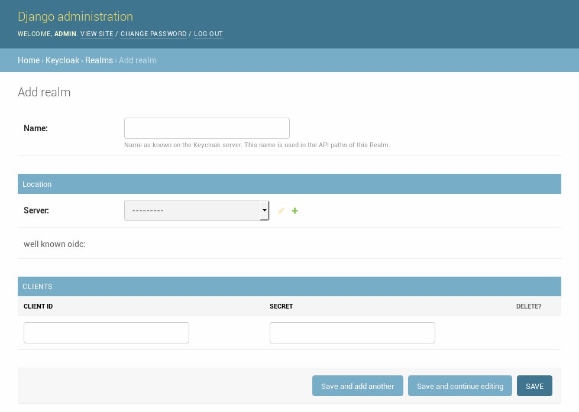

===========================================
Welcome to Django Keycloak's documentation!
===========================================

.. toctree::
   :maxdepth: 2

Django Keycloak adds Keycloak support to your Django project. It's build on top
of `Django's authentication system <https://docs.djangoproject.com/en/1.11/ref/contrib/auth/>`_.
It works side-by-side with the standard Django authentication implementation and
has tools to migrate your current users and permissions to Keycloak.

This library is based on the `Python Keycloak client <https://github.com/Peter-Slump/python-keycloak-client>`_

Installation
============

Install requirement.

.. code-block:: bash

    $ pip install git+https://github.com/Peter-Slump/django-keycloak.git

Add `django-keycloak` to your installed apps, configure the authentication
backend and middleware. Point to the correct login page.

.. code-block:: python

    # your-project/settings.py
    INSTALLED_APPS = [
        ....

        'django_keycloak.apps.KeycloakAppConfig'
    ]

    MIDDLEWARE = [
        ...

        'django_keycloak.middleware.BaseKeycloakMiddleware',
    ]

    AUTHENTICATION_BACKENDS = [
        ...

        'django_keycloak.auth.backends.KeycloakAuthorizationCodeBackend',
    ]

    LOGIN_URL = 'keycloak_login'

    AUTH_USER_MODEL = '<YOUR USER MODEL>'

.. note::
    To use Django Keycloak without storing a User Model in the application'
    you should set the ``AUTH_USER_MODEL`` to ``None`` and use the
    ``django_keycloak.auth.backends.KeycloakRemoteUserAuthorizationCodeBackend``
    instead of the backend described in the example.

Realm configuration
===================

After you have created a
`REALM <http://www.keycloak.org/docs/latest/server_admin/index.html#_create-realm>`_
and `Client <http://www.keycloak.org/docs/latest/server_admin/index.html#_clients>`_
in Keycloak you can add these in the Django admin.

.. note:: Django-Keycloak supports multiple realms. However when you configure
          multiple realms you have to write your own middleware which selects
          the correct realm based on the request. The default middleware always
          selects the first realm available in the database.

.. note:: When your application access the Keycloak server using a different url
than the public one you can configure this URL as "internal server url". Django
Keycloak will use that url for all direc communication but uses the standard
server url to redirect users for authentication.

After you have added the realm please make sure to run te following actions:

    * :ref:`refresh_openid_connect_well_known`
    * :ref:`refresh_certificates`
    * :ref:`synchronize_permissions` (when using the permission system)

Tools
=====

.. _refresh_openid_connect_well_known:

----------------------------------
Refresh OpenID Connect .well-known
----------------------------------

In the Django Admin you can apply the action "Refresh OpenID Connect
.well-known" for a realm. This retrieves the
`.well-known <http://www.keycloak.org/docs/latest/securing_apps/index.html#endpoints>`_
content for the OpenID Connect functionality and caches this in the database. In
this way it's not required to fetch this file before each request regarding
OpenID Connect to the Keycloak server.

-----------------------
Refresh UMA .well-known
-----------------------

In the Django Admin you can apply the action "Refresh UMA .well-known" for a
realm. This retrieves the .well-known content for the UMA functionality and
caches this in the database. In this way it's not required to fetch this file
before each request regarding UMA to the Keycloak server.

.. note::
    This is a legacy action. There is currently no UMA-related functionality
    available in Django-Keycloak.

.. _refresh_certificates:

--------------------
Refresh Certificates
--------------------

This refreshes the cached certificates from the Keycloak server. These
certificates are used for valiation of the JWT's.

-------------------
Clear client tokens
-------------------

While debugging client service account permissions it's sometimes required to
refresh te session in order to fetch the new permissions. This can be done with
this action in the Django admin.

.. _synchronize_permissions:

-----------------------
Synchronize permissions
-----------------------

This Django Admin action which can be triggered for a realm synchronizes all
available permission to Keycloak. In keycloak the permissions will get
registered as roles. These roles can be added to a user.

--------
Add user
--------

A management command is available to add a local user to Keycloak.

.. code:: bash

    $ python manage.py keycloak_add_user --realm <insert realm name> --username <insert user name>

.. note:: In theory it would be possible to synchronize (hashed) passwords to
    Keycloak however Keycloak uses a 512 bit hash for pbkdf2_sha256 hashed
    passwords, Django generates a 256 bits hash. In that way passwords will not
    work when they are copied to Keycloak. The project includes a sha512 hasher
    (:class:`django_keycloak.hashers.PBKDF2SHA512PasswordHasher`) which you can
    configure to hash passwords in a Keycloak-complient way.

    .. code:: python

        # your-project/settings.py
        PASSWORD_HASHERS = [
            'django_keycloak.hashers.PBKDF2SHA512PasswordHasher',
        ]

Usage
=====

For requiring a logged in user you can just use the `standard Django
functionality <https://docs.djangoproject.com/en/1.11/topics/auth/default/#limiting-access-to-logged-in-users>`_.
This also counts for `enforcing permissions <https://docs.djangoproject.com/en/1.11/topics/auth/default/#the-permission-required-decorator>`_.
